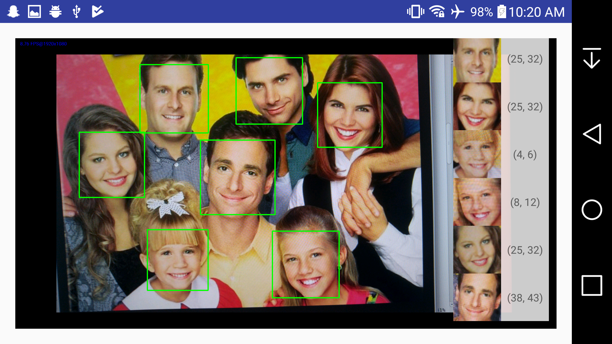
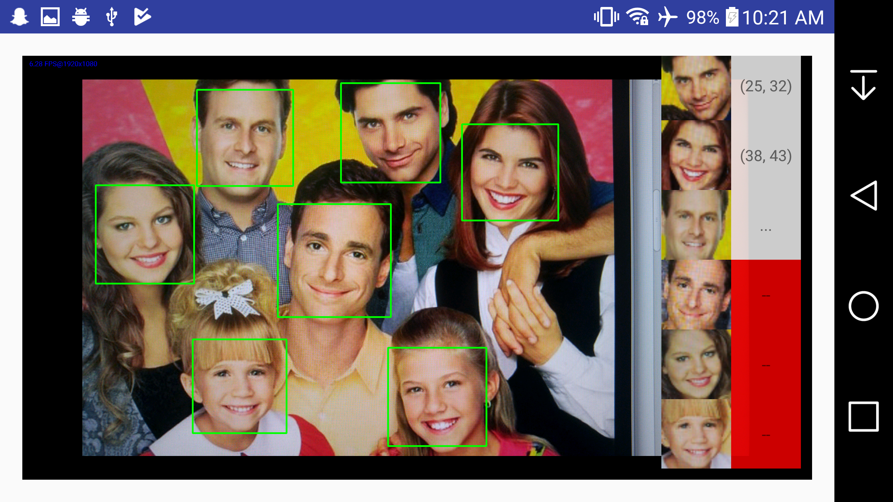

# Age Estimation App for Android #
 This fun android app can estimate the ages of people using face detection and tensorflow. 
 
 ## Introduction ## 
This app uses multi face detection accomplished by using a pre-trianed LBP cascade classifier and OpenCV. The detected faces are extracted using the bounding box and feed into a pre-trained Inceptionv3 model. The Inception model's output is interpreted to get the best guessed age range class for each face and the results are displaied on screen.  
  
The pre-trained classifier and Inception models are included in this repository.
  
The application was created for a class assignment, as such please exclude the poor coding choices due to the hastyness under which this app was developed. With this app, I was able to learn some basics regarding android development using OpenCV and Tensorflow.

## Building the app ##
Import the application from the [AndroidOpenCVVideoProcessing](AndroidOpenCVVideoProcessing) dir into Android Studio as a gradel application.  
  
[build.gradle](AndroidOpenCVVideoProcessing/app/build.gradle) will need to be modified for configuring Bazel binary location, target archtecture, and tensorflow source dir.
  
It requires a device with a Camera and Android OS version >= 23. Everything should be included, aside from build dependencies provided by Android Studio. This project was build on Ubuntu 16.04 only. See [Requirements](#requirements) for a more complete set of dependancies.

## How to Use ##
Simply start the app, point the camera at the faces you wish to guess ages with. Once boxes appear around detected faces, tap the screen once and the faces will be processed. The results will display on the screen. I limited the app to guess only 6 faces at a time, due to the GUI design choice. 

It may take a few seconds to process each face, so the GUI will indicate progress as follows:
  * __Processesed__: White box with `(x,y)` age range
  * __Processing__:  White box with `...`
  * __Unprocessed__: Red box with `--`
  

## Face Detection ##
AndroidOpenCVVideoProcessing/app/src/main/res/raw/

## Requirements ##
  * Software
    * Ubuntu (built on v16.04)
    * Android Studio
    * Bazel
    * cmake
    * Tensorflow
    * OpenCV for android (Included v3.0.0)
  * Hardware (Andriod Pone)
    * Phone with Android OS >= v5.0 (API 23, Marshmallow)
    * Camera

